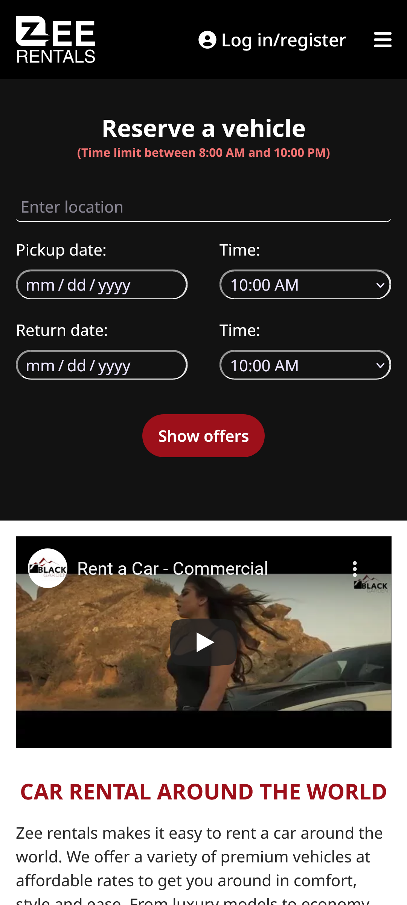
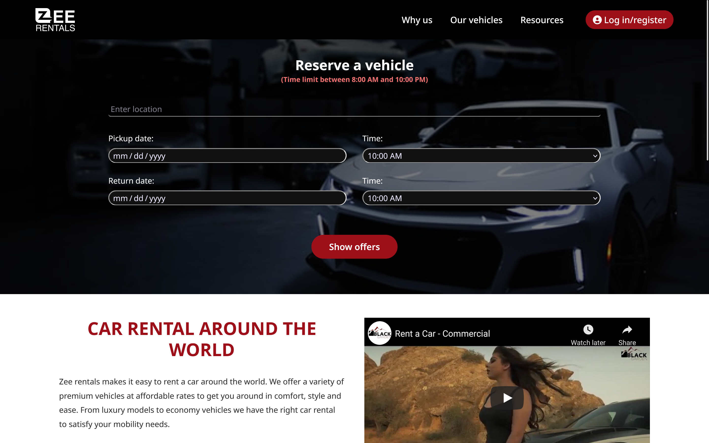

# FreeCodeCamp - Product Landing project

This project is focused on building an app that is functionally similar to [FreeCodeCamp landing page](https://product-landing-page.freecodecamp.rocks/).

## Table of contents

- [Overview](#overview)
  - [User Stories](#user-stories)
  - [Screenshot](#screenshot)
  - [Links](#links)
- [My process](#my-process)
  - [Built with](#built-with)
  - [What I learned](#what-i-learned)
  - [Useful resources](#useful-resources)
- [Author](#author)

## Overview

### User Stories

The following guidelines were provided:

- Your product landing page should have a header element with a corresponding id="header"

- You can see an image within the header element with a corresponding id="header-img" (A logo would make a good image here)

- Within the #header element, you can see a nav element with a corresponding id="nav-bar"

- You can see at least three clickable elements inside the nav element, each with the class nav-link

- When you click a .nav-link button in the nav element, you are taken to the corresponding section of the landing page

- You can watch an embedded product video with id="video"

- Your landing page has a form element with a corresponding id="form"

- Within the form, there is an input field with id="email" where you can enter an email address

- The #email input field should have placeholder text to let users know what the field is for

- The #email input field uses HTML5 validation to confirm that the entered text is an email address

- Within the form, there is a submit input with a corresponding id="submit"

- When you click the #submit element, the email is submitted to a static page (use this mock URL: https://www.freecodecamp.com/email-submit)

- The navbar should always be at the top of the viewport

- Your product landing page should have at least one media query

- Your product landing page should utilize CSS flexbox at least once

### Screenshot




### Links

- Solution URL: [Add solution URL here](https://your-solution-url.com)
- Live Site URL: [Add live site URL here](https://your-live-site-url.com)

## My process

### Built with

- Semantic HTML5 markup
- CSS custom properties
- Mobile-first workflow

### What I learned

- I was having problem with toggling the sidebar on and off. after hiding the sidebar with `#header ul {right: -100%}` it refused to show up when i set `#checkbox:checked ~ ul {right: 0;}` but i solved it by adding nav to it. so the right code is:

```css
#checkbox:checked ~ nav ul {
  right: 0;
}
```

- another issue that came up was trying to position the navbar toggler to the far right. despite using flexbox `justify-content: space-between`, it still didn't align it to the right. A quick google search showed i have to set a `margin-left: auto` on the log in/register button and that fixed the issue.

### Useful resources

[mdn web docs](https://developer.mozilla.org/en-US/docs/Web/CSS/CSS_Flexible_Box_Layout/Aligning_Items_in_a_Flex_Container) gave me the solution on how to align flex items horizontally using `margin-left` auto

## Author

- Twitter - [@kushyzeena](https://www.twitter.com/kushyzeena)
